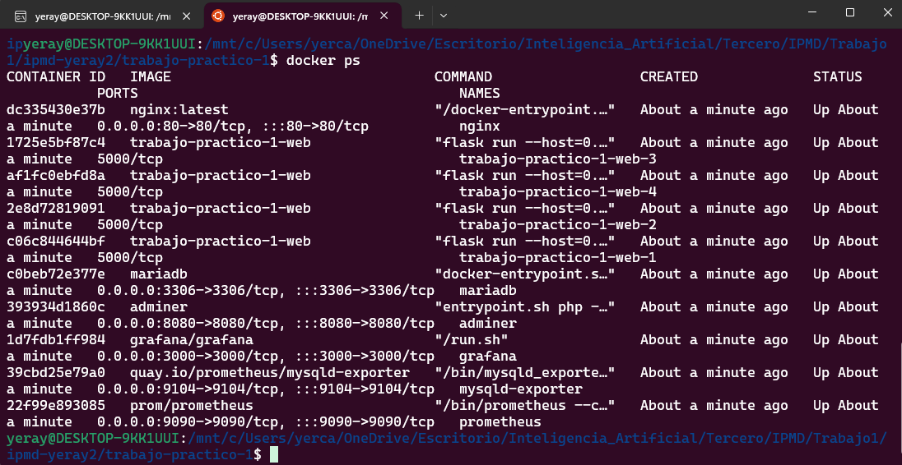
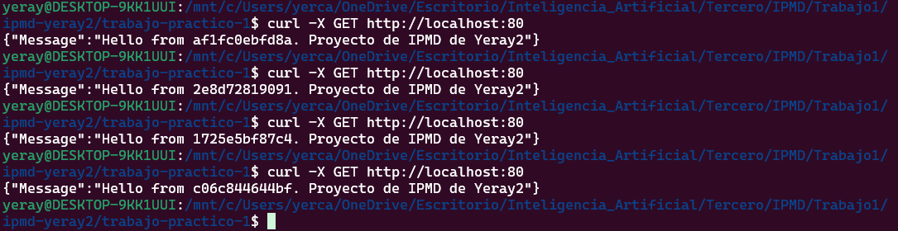
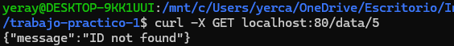
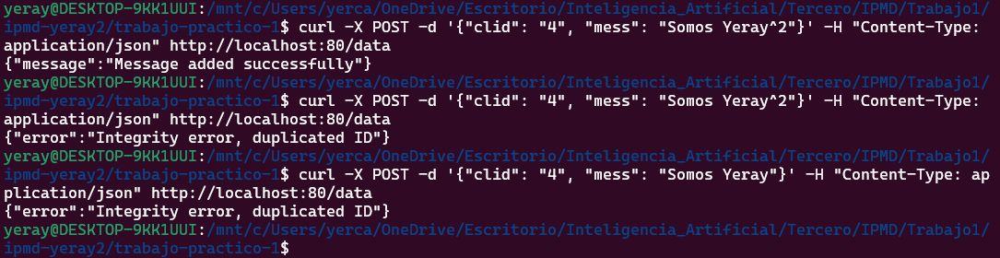
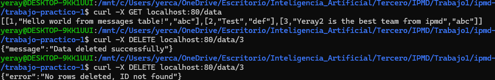
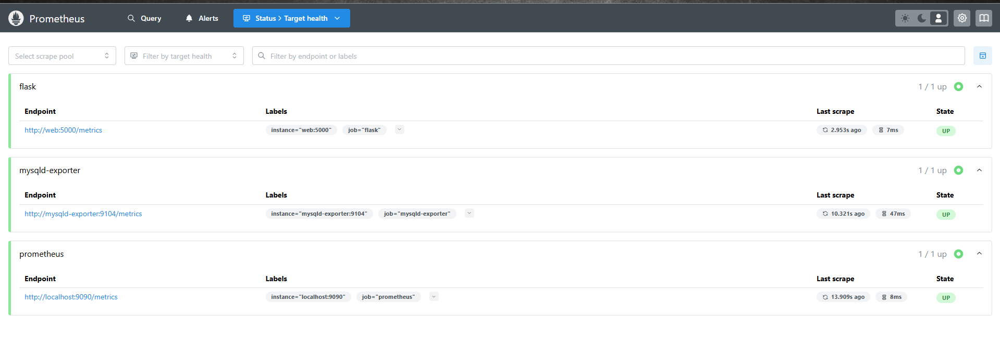
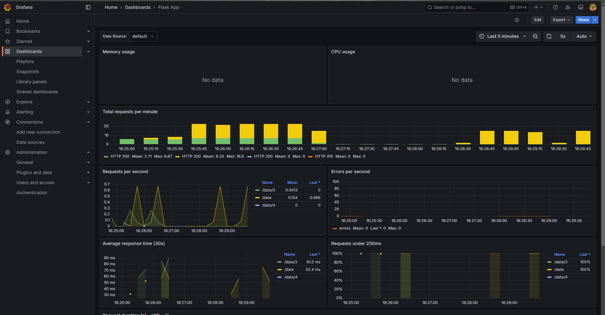
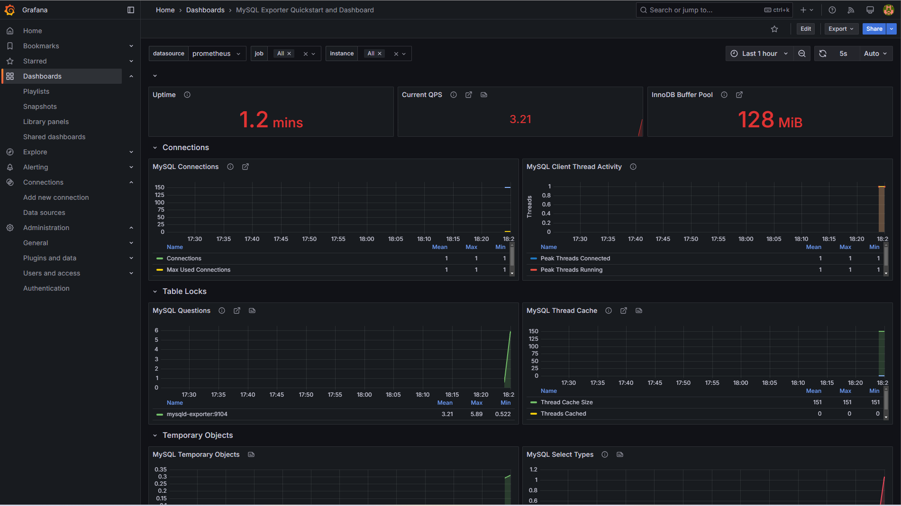

# Trabajo práctico 1. Yeray Carretero y Yeray Li.

## Estructura del proyecto

```bash
├── app.py
├── config.my-cnf
├── db
│   └── init.sql
├── docker-compose.yaml
├── Dockerfile
├── memoria.md
├── nginx.conf
├── prometheus.yml
├── README.md
└── requirements.txt
```

* `Dockerfile`:  Define la imagen de Docker para la API Flask, instalando dependencias y configurando su ejecución.
* `app.py`: Código fuente de la API REST en Flask, que gestiona operaciones sobre la base de datos.
* `config.my-cnf`: Archivo de configuración para MySQL/MariaDB, estableciendo parámetros como credenciales y rendimiento.
* `db/init.sql`: Script SQL que inicializa la base de datos y crea las tablas necesarias.
* `docker-compose.yaml`: Orquesta todos los servicios (API, BD, Adminer, Prometheus, Grafana, etc.) en contenedores.
* `nginx.conf`: Configuración de Nginx como balanceador de carga para distribuir tráfico entre instancias de la API.
* `prometheus.yml`: Configuración de Prometheus para recolectar métricas de los servicios en ejecución.
* `requirements.txt`: Lista de dependencias de Python necesarias para la API (Flask, conectores MySQL, métricas, etc.).

### [`Dockerfile`](https://github.com/Wolfxyz16/ipmd-yeray2/blob/main/trabajo-practico-1/Dockerfile) 

```Dockerfile
FROM python:3.10-alpine
WORKDIR /app
ENV FLASK_APP=app.py
RUN apk add --no-cache gcc musl-dev linux-headers mysql-client
COPY requirements.txt requirements.txt
RUN pip3 install -r requirements.txt
EXPOSE 5000
COPY . .
CMD ["flask", "run", "--host=0.0.0.0", "--port=5000"]
```

Dentro especificamos una imagen con el sistema operativo alpine y la versión 3.10 de python.

* En `WORKDIR` es el directorio donde flask va a buscar sus configuraciones
* En `COPY` indicamos los modulos que queremos instalar en python
* En `EXPOSE` indicamos que los contenedores creados con este dockerfile expongan el puerto 5000
* Por último, en `CMD` indicamos el comando que ejecuta una vez se crea, en este caso arrancar el servidor de flask

### [`nginx.conf`](https://github.com/Wolfxyz16/ipmd-yeray2/blob/main/trabajo-practico-1/nginx.conf)

```
events {}

http {
    upstream flask_backend {
        server web:5000;
    }

    server {
        listen 80;

        location / {
            proxy_pass http://flask_backend;
            proxy_set_header Host $host;
            proxy_set_header X-Real-IP $remote_addr;
            proxy_set_header X-Forwarded-For $proxy_add_x_forwarded_for;
        }
    }
}
```

Este archivo de configuración es para **NGINX** y actúa como un **proxy inverso** para una aplicación Flask que se ejecuta en un contenedor llamado `web` en el puerto `5000`. 

- Define un grupo de servidores `upstream` llamado `flask_backend`, que apunta a `web:5000`, el nombre del servicio que hemos definido.  
- En el bloque `server`, NGINX escucha en el puerto `80` y redirige todas las solicitudes (`/`) a `flask_backend` mediante `proxy_pass`.  

### [`prometheus.yml`](https://github.com/Wolfxyz16/ipmd-yeray2/blob/main/trabajo-practico-1/prometheus.yml)

```yml
global:
  scrape_interval: 15s

scrape_configs:
  - job_name: 'prometheus'
    static_configs:
      - targets: ['localhost:9090']

  - job_name: 'flask'
    static_configs:
      - targets: ['web:5000']

  - job_name: 'mysqld-exporter'
    static_configs:
      - targets: ['mysqld-exporter:9104']
```

Este archivo es la configuración que usara Prometheus, en este definimos qué servicios se van a monitorear y con qué frecuencia.
- Mediante `global` se sefine el intervalo de scrapeo, cada 15 segundos.
- Con la función `scrape_configs` definimos las configuraciones para obtener métricas de distintos endpoint.
- Mediante `job_name` nombramos que servicio queremos monitorear y con la opción `targets` indicamos en que puerto se estan exportando las metricas.

### [`./db/init.sql`](https://github.com/Wolfxyz16/ipmd-yeray2/blob/main/trabajo-practico-1/db/init.sql)

```sql
-- Creamos los usuarios
CREATE USER IF NOT EXISTS 'wolfxyz'@'%' IDENTIFIED BY 'wolfxyz';
CREATE USER IF NOT EXISTS 'prometheus'@'%' IDENTIFIED BY 'prometheus';

-- Creamos la base de datos
CREATE DATABASE IF NOT EXISTS ipmd;

-- Damos privilegios a los usuarios
-- prometheus necesita todos los permisos para monitorizar
GRANT PROCESS, REPLICATION CLIENT, SELECT ON *.* TO 'prometheus'@'%';
GRANT ALL PRIVILEGES ON ipmd TO 'wolfxyz'@'%';
GRANT PROCESS, REPLICATION CLIENT, SELECT ON *.* TO 'wolfxyz'@'%';
GRANT SLAVE MONITOR ON *.* TO 'wolfxyz'@'%';
GRANT REPLICATION CLIENT ON *.* TO 'wolfxyz'@'%';

-- Aplicamos los privilegios
FLUSH PRIVILEGES;

-- Dentro de la base de datos de ipmd, creamos la tabla messages y añadimos dumb data
USE ipmd;

CREATE TABLE IF NOT EXISTS messages (
  clid INT NOT NULL,
  mess TEXT NOT NULL,
  sid TEXT NOT NULL,
  PRIMARY KEY(clid)
);

INSERT INTO messages (clid, mess, sid) VALUES
(1, 'Hello world from messages table!', 'abc'),
(2, 'Test', 'def'),
(3, 'Yeray2 is the best team from ipmd', 'abc');
```

Este archivo SQL crea dos usuarios (`wolfxyz` y `prometheus`) con acceso remoto, define la base de datos `ipmd` si no existe y asigna permisos específicos a cada usuario. `prometheus` recibe privilegios de monitoreo, mientras que `wolfxyz` obtiene acceso total a la base de datos `ipmd` y permisos adicionales relacionados con la replicación. Luego, se crean los privilegios con `FLUSH PRIVILEGES`. Finalmente, dentro de `ipmd`, se define una tabla llamada `messages` con tres columnas (`clid`, `mess`, `sid`) y se insertan tres registros de prueba.  

### [`app.py`](https://github.com/Wolfxyz16/ipmd-yeray2/blob/main/trabajo-practico-1/app.py)

Los métodos de `app.py` están explicados dentro del archivo en formato python docs.

### [`config.my-cnf`](https://github.com/Wolfxyz16/ipmd-yeray2/blob/main/trabajo-practico-1/config.my-cnf)

Guarda las métricas para que se puedan exportar al mariadb.

## Servicios

> [!IMPORTANT]
> Tenemos que explicar como entrar a grafana y a mariadb. Explicar todo un poco mas en general

Vamos a ir explicando los servicios a la vez que el bloque de código que los define en el archivo [`docker-compose.yaml`](https://github.com/Wolfxyz16/ipmd-yeray2/blob/main/trabajo-practico-1/docker-compose.yaml).

Dentro de este archivo definimos los servicios que levantaremos luego con el comando `docker-compose up --build`. En nuestro caso, cada servicio esta asociado a un contenedor, excepto el servicio web que lo tenemos replicado con 4 copias. Por último, todos los servicios que tenemos estan dentro de la red llamada `trabajo1`.

### Web (flask)
En el servicio de web tenemos una simple API REST hecha con flask, un framework escrito en python. Esta es una API REST sencilla donde se implementa una base de datos con mensajes escritos, su id, y el contenedor donde se han creado.

```yaml
  web:
    build: .
    expose:
      - "5000"
    depends_on:
      - mariadb
    deploy:
      mode: replicated
      replicas: 4
    networks:
        - trabajo1
```

En el servicio web tenemos que expone el puerto 5000, depende del servicio mariadb, hasta que el servicio mariadb no este arrancado no se van crear los contenedores de web; en deploy especificamos cuántas veces queremos el contenedor replicado.

### Mariadb
En el servicio de Mariadb hay alojada un servidor mariadb que se encarga de almacenar toda la información. Cuando una instancia web recibe una petición REST, esta se comunica con el servidor para llevar a cabo la tarea. A la hora de crear el contenedor, montamos un volumen en el directorio `/docker-entrypoint-initdb.d/`. Dentro del volumen le pasamos un pequeño script sql para que el servidor ejecutará al iniciarse. Dentro del script creamos la base de datos, definimos las tablas, creamos los usuarios y definimos los permisos para que solo puedan acceder a la base de datos de la aplicación.

```yaml
  mariadb:
    image: mariadb
    container_name: "mariadb"
    restart: always
    ports:
      - "3306:3306"
    volumes:
      - ./db:/docker-entrypoint-initdb.d/:ro
    environment:
      MYSQL_ROOT_PASSWORD: root
      MYSQL_USER: wolfxyz
      MYSQL_PASSWORD: wolfxyz
      MYSQL_DATABASE: ipmd
    networks:
      - trabajo1
```

El servicio mariadb contiene el servidor donde se ejecuta el SGBD mariadb. Indicamos la imagen de mariadb, definimos el nombre y que cuando el servicio se caiga o docker se detenga (`restart: always`). En la línea de puerto mapeamos el puerto 3306 con el puerto 3306 de nuestro ordenador. En volumenes le indicamos el directorio  `./db` de nuestro repositorio, en el encontramos un script que el servidor ejecutará cada vez que se inicie.

En la línea de `environment` le indicamos al contenedor las variables de entorno que tiene que tener sus sistema operativo. En nuestro caso nos ayudan a pre-configurar el servidor mariadb.

### Adminer
El servicio de Adminer consiste en una interfaz web donde podemos acceder a la base de datos de mariadb. Sinceramente solo lo hemos usado para comprobar que la base de datos ha ejecutado el archivo de inicialización.

```yaml
adminer:
    image: adminer
    container_name: "adminer"
    restart: always
    ports:
      - "8080:8080"
    environment:
      ADMINER_DEFAULT_SERVER: mariadb
    networks:
      - trabajo1
```

### mysqld-exporter
El servicio de mysqld-exporter actúa como un adaptador que extrae métricas internas de MariaDB y las convierte en un formato compatible con Prometheus. Este servicio se encarga de recopilar información clave sobre el rendimiento de la base de datos, como el uso de conexiones, el tiempo de respuesta de las consultas, el consumo de recursos y el estado de los índices. Luego, expone estas métricas a través de un endpoint HTTP accesible por Prometheus, permitiendo su almacenamiento y análisis en tiempo real.

```yaml
mysqld-exporter:
      image: quay.io/prometheus/mysqld-exporter
      container_name: "mysqld-exporter"
      restart: always
      ports:
        - "9104:9104"
      command:
        - "--config.my-cnf=/etc/.my.cnf"
        - "--mysqld.address=mariadb:3306"
      volumes:
        - ./config.my-cnf:/etc/.my.cnf
      extra_hosts:
        - "mysqld-exporter:127.0.0.1"
      networks:
        - trabajo1
```

### Prometheus
El servicio de Prometheus es una herramienta open-source para la gestión de
datos de monitorización de aplicaciones y servicios. Mediante este servicio extraerán las métricas almacenadas en el servicio de mysqld-exporter. Aunque este, sí que nos permite visualizar métricas de manera intuitiva, prometheus actuará como datasource Grafana.

```yaml
prometheus:
    image: prom/prometheus
    container_name: "prometheus"
    restart: always
    ports:
      - "9090:9090"
    volumes:
      - ./prometheus.yml:/etc/prometheus/prometheus.yml
    networks:
      - trabajo1
```

### Grafana
Grafana es una herramienta open-source para visualizar series temporales en una interfaz WebUI. Mediante Grafana se nos permite crear dashboards interactivos y personalizables para monitorear el estado y rendimiento de aplicaciones, bases de datos y servidores en tiempo real. 
Para obtener los datos Grafana necesita de un datasource el cual almacenará y proporcionará los datos en tiempo (Prometheus).

```yaml
grafana:
    image: grafana/grafana
    container_name: "grafana"
    restart: always
    ports:
      - "3000:3000"
    networks:
       - trabajo1
    volumes:
      - grafana-storage:/var/lib/grafana
```

### Nginx
El servicio de nginx contiene un servidor web nginx. En nuestro caso usamos este contenedor como balanceador de carga ya que tenemos el servicio web con replicación. Este es otro servicio que ha sido relativamente fácil de implementar ya que solo tenemos que indicar en el archivo de configuración el nombre del servicio y el puerto.

```yaml
nginx:
    image: nginx:latest
    container_name: "nginx"
    volumes:
      - ./nginx.conf:/etc/nginx/nginx.conf:ro
    ports:
      - "80:80"
    depends_on:
      - web
    networks:
      - trabajo1
```

## Modo de uso
1. Clona el repositorio:
    ```bash
    git clone https://github.com/Wolfxyz16/ipmd-yeray2.git
    ```
2. Navega al directorio del proyecto:
    ```bash
    cd ipmd-yeray2/trabajo-practico-1
    ```
3. Ejecutar docker compose
    ```bash
    docker compose up -d
    ```

    * Comprobamos que los contenedores esten levantados
    ```bash
    docker ps
    ```

    

    * Comprobamos que el servicio web+nginx esté en funcionamiento
    ```bash
    curl -X GET http://localhost:80/data
    ```

    

4. Acceder a los servicios:
    ```bash
    API Flask + nginx: http://localhost:80

    Adminer: http://localhost:8080

    Prometheus: http://localhost:9090

    Grafana: http://localhost:3000
    ```

* Podemos comprobar también que la aplicación tiene los errores controlados:







5. Prometheus

Si entramos en [http://localhost:9090](http://localhost:9090) podemos ver los servicios que monitorea prometheus.



6. Paneles de grafana
     ```bash
    Panel para MySQL Exporter: código 14057 de la biblioteca de paneles de Grafana
    Panel para aplicaciones Flask: se facilita en formato JSON
    Panel extra para mariadb utiles : código 13106 de la biblioteca de paneles de Grafana
    ```

    

    
