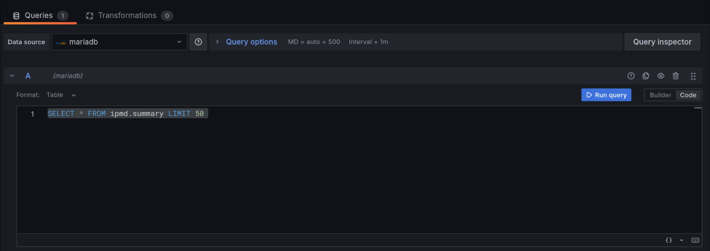
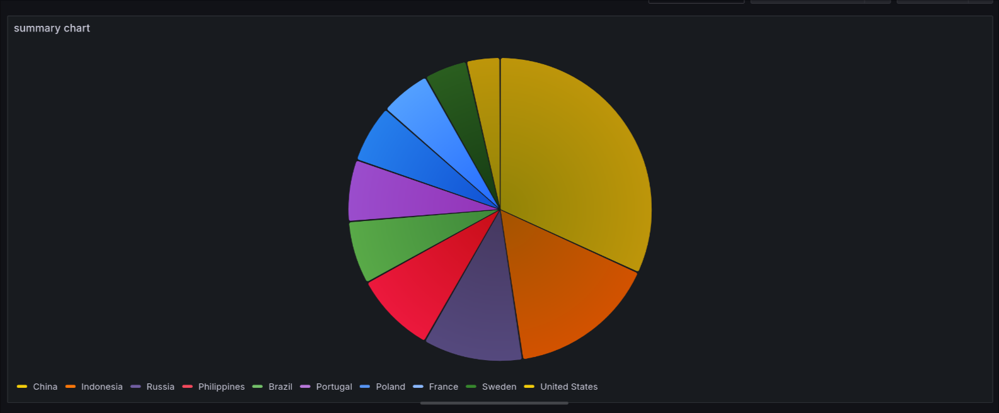

# Procesamiento con Hive y visualización con Grafana

> [!Note]
> DEADLINE -> 9 de abril / 23:59

## Pasos a seguir

### Empezar los servicios

Construimos el archivo `docker compose`.

```bash
docker compose build
```

Lo arrancamos y lo ponemos en segundo plano.

```bash
docker compose up --detach
```

Debemos esperar unos segundos antes de continuar con la guia con el fin de que todos los contenedores arranquen correctamente, sobre todo la base de datos mariadb.

### Crear la estructura hdfs

Ejecutamos el archivo `./init_hdfs.sh` para iniciar correctamente la configuración de namenode y cargar los archivos correctamente en hive:

```bash
docker exec -it namenode ./init_hdfs.sh
```

Comprobamos que se ha ejecutado correctamente

```bash
docker exec -it datanode-1 hdfs dfs -ls hdfs://namenode/user/hive/userdata
docker exec -it datanode-1 hdfs dfs -ls hdfs://namenode/user/hive/estructura
```

### Crear hive-server

Una vez los datos estan añadidos correctamente nos metemos en el contendor de hive y ejecutamos el `init_hive.sql`:

```bash
docker exec -it hive-server beeline -u jdbc:hive2://localhost:10000/ -f ./init_hive.sql
```

Tardará unos 10 segundos pero debemos ver que el status es `SUCCEEDED`. Una vez tenemos el servidor hive vamos a ejecutar un comando para comprobar que las tablas se han creado en hive correctamente

```bash
docker exec hive-server beeline -u jdbc:hive2://localhost:10000/ -e !tables
```

### Llenar la base de datos, mariadb

El siguiente paso a realizar será pasar la información de las tablas que contiene hive a nuestro servidor mariadb que tenemos desplegado en un contendor. Para ello usaremos un *script* que es encuentra en la carpeta `ejecutor`. Ejecutamos el *script* `init.sh`:

```bash
./ejecutor/init.sh
```

Cuando termine el script vamos a ejecutar la siguiente consulta para comprobar que la tabla se ha llenado correctamente.

```bash
docker exec mariadb mariadb --user=wolfxyz --password=wolfxyz --table ipmd -e "SELECT * FROM summary"
```

### Grafana

Para la creación de Grafana debemos acceder a su interfaz web desde un navegador. Así que vamos a ir a la dirección, 

#### [http://localhost:3000/login](http://localhost:3000/login)

Primero debemos iniciar sesión. Las credenciales son wolfxyz wolfxyz.


Dentro del panel principal debemos de ir al menu y buscar la opción *Add new connection*.


Entramos y dentro nos saldrán una lista de diferentes *datasources*. El *datasource* debe de ser de tipo MySQL. Lo seleccionamos y luego en *Add new data source*.

Debemos especificar que el nombre del *data source* sea **mariadb**. La conexión al host dentrá la dirección `172.18.0.10`. El nombre de la base de datos será `ipmd`. Por último sus credenciales serán wolfxyz wolfxyz.


Seleccionamos la opción al final de la página que dice *Save & test*, y deberiamos ver un cuadrado verde que nos indique que la conexión ha sido exitosa.

Ahora en el menú de grafana seleccionaremos la opción **Dashboards** y dentro la opción de crear un nuevos **Dashboard**.

Dentro de este menú, nos aparecerán tres opciones diferentes. Nosotros debemos seleccionar la que dice **+ Add visualization**.


Ahora debemos seleccionar el *data source* que habiamos creado antes.


En este menú de creación de dashboards debemos ahora de seleccionar que tipo de gráfico queremos. A la izquierda del menú tenemos seleccionada la opción de **time-series**. Debemos quitarla y poner **Pie Chart**. Además en la opción de **Value options - show** debemos indicarle **All values**. Tambíen podemos cambiarle el nombre a **summary chart** para hacerlo mas profesional.


Ahora debemos indicarle que tabla queremos supervisar. Dentro de las opciones de *query* pulsamos en **Code** y añadimos lo siguiente:

```sql
SELECT * FROM ipmd.summary LIMIT 50 
```



Ahora deberiamos ver un gráfico parecido a este donde cada color represanta a un país:



### Superset
[TODO]

### End

Al terminar debemos parar y eliminar todos los contenedores que hemos creado con el siguiente comando:

```bash
docker compose down --volumes --remove-orphans
```
