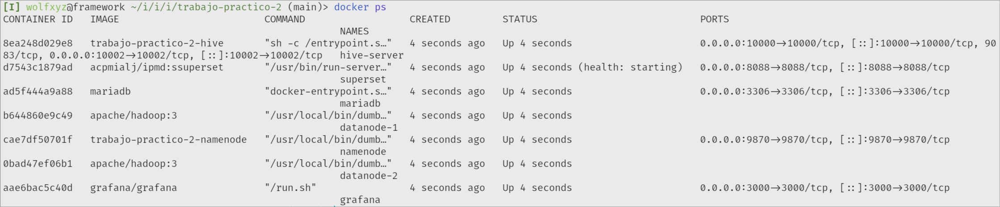

# Trabajo práctico 2. Yeray Carretero y Yeray Li.

## Estructura del proyecto

```bash
├── config
├── db
│   └── init.sql
├── docker-compose.yaml
├── ejecutor
│   ├── Dockerfile
│   ├── export_to_mariadb.py
│   ├── init.sh
│   └── requeriments.txt
├── hive
│   ├── Dockerfile
│   └── init_hive.sql
├── namenode
│   ├── Dockerfile
│   └── init_hdfs.sh
├── estructura
│   └── userdata.avsc
└── userdata
    ├── userdata1.avro
    ├── userdata2.avro
    ├── userdata3.avro
    ├── userdata4.avro
    └── userdata5.avro
```

* `docker-compose.yaml`: Orquesta todos los servicios (BD, Hive, Namenode, Datanodes, etc.) en contenedores.
* `config`: Configuración con la que se inicara el contenedor namenode y datanode.


* `db/init.sql`: Script SQL que inicializa la base de datos y crea las tablas necesarias. En este trabajo, las tablas creadas son para asegurar la implementación tanto de grafana como de superset

* `ejecutor/init.sh`: Script para la ejecución del contenedor que va a copiar los datos desde hive a mariadb.
* `ejecutor/Dockerfile`:  Define la imagen de Docker para un contenedor de python, instalando dependencias y configurando su ejecución.
* `ejecutor/export_to_mariadb.py`:  Creamos conexiones con los contenedores de Hive y Mariadb para poder migrar los datos de Hive a una base de datos en Mariadb.
* `ejecutor/requeriments.txt`: Lista de dependencias de python necesarias para ejecutar el contenedor.

* `hive/Dockerfile`:  Define la imagen de Docker para un contenedor de Hive, instalando dependencias y configurando su ejecución.
* `hive/init_hive.sql`:  Crearemos las tablas necesarias para el trabajo, obteniendo los datos que han sido subidos a HDFS.

* `namenode/Dockerfile`:  Define la imagen de Docker para un contenedor de Hadoop, instalando dependencias y configurando su ejecución.
* `namenode/init_hdfs.sh`:  Se inicia el NameNode de HDFS, se crean directorios, se asignan permisos y se suben archivos `.avro` a HDFS.

* `estructura/`:  Carpeta que contiene la estructura de la base de datos que crearemos `userdata.avsc`.
* `userdata/`:  Carpeta que alamacena los datos de la base de datos en formato `.avro`.

Ahora vamos a explicar que hace cada servicio que se detallada en el archivo `docker-compose.yaml` y los archivos que lo componen.

## Servicio «ejecutor»

Técnicamente no es un servicio ya que lo ejecutamos manualmente una vez que hive ya tiene datos. Este contenedor se encarga de pasar los datos que tenemos en hive a una tabla en nuestro servicio mariadb. Consiste en una imagen `python:3` que ejecuta un script que hemos programado. 

### [`ejecutor/Dockerfile`](https://github.com/Wolfxyz16/ipmd-yeray2/blob/main/trabajo-practico-2/ejecutor/Dockerfile) 

Imagen del contendor.

```Dockerfile
FROM python:3

WORKDIR /trabajo-practico-2

COPY requeriments.txt .
RUN pip install --no-cache-dir -r requeriments.txt

COPY ./export_to_mariadb.py ./export_to_mariadb.py
RUN chmod +x export_to_mariadb.py

CMD [ "python", "./export_to_mariadb.py" ]
```

### [`ejecutor/init.sh`](https://github.com/Wolfxyz16/ipmd-yeray2/blob/main/trabajo-practico-2/ejecutor/init.sh)

Script que construye la imagen, lanza el contenedor y por último elimina la imágen.

```sh
#!/usr/bin/env bash
cd "$(dirname "$0")"

docker build -t ejecutor ../ejecutor
docker run --name=ejecutor --network=mynet ejecutor

# habría que comprobar que el comando se llega a ejecutar
docker stop ejecutor
docker rm ejecutor
docker image rm ejecutor
```

### [`ejecutor/export_to_mariadb.py`](https://github.com/Wolfxyz16/ipmd-yeray2/blob/main/trabajo-practico-2/ejecutor/export_to_mariadb.py) 

Consiste en crear dos conexiones, una a mariadb y la otra a hive. Una vez las conexiones son correctas copiamos los datos dentro de la tabla `summary` de mariadb. Tenemos que ejecutarlo cuando hive ya tenga los datos cargados y cuando nos aseguremos de que mariadb se está ejecutando.

## Servicio Hive

### [`hive/Dockerfile`](https://github.com/Wolfxyz16/ipmd-yeray2/blob/main/trabajo-practico-2/hive/Dockerfile) 

Hive nos permite almacenar los datos y poder consultarlos usando sentencias SQL. Esta es la imágen de Docker con el que lo definimos. Usamos la imágen oficial de `apache/hive:4.0.0` y luego le añadimos los el script de inicialización y los datos.

```Dockerfile
FROM apache/hive:4.0.0

# Establecer el directorio de trabajo
WORKDIR /trabajo-practico-2
USER root

# Asegurar permisos de root para instalar paquetes
RUN apt-get update && apt-get install -y python3-pip 

# Copiar e instalar dependencias de Python
RUN mkdir -p /home/hive/.beeline && chown hive:hive /home/hive/.beeline
USER hive

# Copiar los scripts y datos
COPY hive/init_hive.sql init_hive.sql
COPY userdata /app/userdata 

# # Añadimos los archivos de configuracion
# ADD hive/hive-site.xml /opt/hive/conf/hive-site.xml

# Ejecutar SQL en Hive y luego exportar a MariaDB
CMD [beeline -u jdbc:hive2://localhost:10000/ -f hive/init_hive.sql]
```

### [`hive/init_hive.sql`](https://github.com/Wolfxyz16/ipmd-yeray2/blob/main/trabajo-practico-2/hive/init_hive.sql) 

En el script de inicialización de hive le indicamos que cree una tabla usando los datos que encuentre en el directorio de `hdfs`. Debemos especificarle también la estructura que se encuentra en otro directorio de `hdfs`.

Una vez lo tenemos creamos una tabla en hive llamada summary que cuenta cuántos usuarios hay por cada país. Esta es la tabla que vamos a exportar luego a mariadb con el contenedor `ejecutor`.

```sql
-- Crear tabla externa con formato AVRO
CREATE EXTERNAL TABLE IF NOT EXISTS usuarios
STORED AS AVRO
LOCATION 'hdfs://namenode/user/hive/userdata'
TBLPROPERTIES ('avro.schema.url'='hdfs://namenode/user/hive/estructura/userdata.avsc');

-- Crear tabla resumen de usuarios por país
CREATE TABLE IF NOT EXISTS summary AS
SELECT country, COUNT(*) AS user_count
FROM usuarios
GROUP BY country
ORDER BY user_count DESC
LIMIT 10;

```

## Servicio HDFS, namenode y datanode.

El almacenamiento en HDFS nos permite guardar grandes volúmenes de datos y está dividido en dos servicios diferentes, el namenode y el datanode.

El namenode es el componente encargado de gestionar la estructura de directorios y la metadata de los archivos en HDFS. Almacena información sobre qué bloques de datos están almacenados en qué datanode. No guarda los datos reales, solo las ubicaciones de los bloques. Si el namenode falla, puede comprometer la integridad del sistema.

El datanode son los encargados de almacenar físicamente los bloques de datos. Cada datanode gestiona los datos que le asignan y realiza operaciones de lectura y escritura según las peticiones del cliente. Además, envían información sobre el estado de los bloques al namenode para asegurar la consistencia y la replicación adecuada de los datos.

La elección de imágenes han sido las oficiales de `apache/hadoop:3` que cuentan con la versión más actualizada. Dentro del archivo `yaml` le indicamos a cada servicio con qué comando tiene que arrancar.

Para los datanodes (en nuestro caso dos), no necesitamos un archivo `Dockerfile`. Sin embargo, para el namenode, sí lo necesitamos. En él vamos a copiar el script que se encargará de crear la estructura de datos (los directorios) con los que vamos a trabajar.

### [`namenode/Dockerfile`](https://github.com/Wolfxyz16/ipmd-yeray2/blob/main/trabajo-practico-2/namenode/Dockerfile) 

Este es el `Dockerfile` que usaremos para especificar al namenode.

```Dockerfile
FROM apache/hadoop:3

# Establecer el directorio de trabajo
WORKDIR /trabajo-practico-2

# Copiar los scripts necesarios
COPY /namenode/init_hdfs.sh init_hdfs.sh

# Ejecutar el script al iniciar el contenedor
CMD ["/bin/bash", "./init_hdfs.sh"]
```

### [`namenode/init_hdfs.sh`](https://github.com/Wolfxyz16/ipmd-yeray2/blob/main/trabajo-practico-2/namenode/init_hdfs.sh) 

Mediante este archivo, crearemos los directorios necesarios para el contenedor namenode.

- Mediante `mkdir` crearemos las carpetas necesarias dentro de hdfs, siempre y cuando la carpeta se cree dentro de `hdfs://namenode/`
- Con el comando `chown` diremos que hive sera el propietario de las carpetas creadas para que pueda acceder sin restricciones a ellas.
- Por ultimo cargamos tanto los datos como la estructura de estos dentro de sus carpetas correspondientes.

```sh
#!/bin/bash
echo "Creating hdfs project structure..."

# Crear y asignar permisos en HDFS
hdfs dfs -mkdir -p hdfs://namenode/user/hive
hdfs dfs -chown hive hdfs://namenode/user/hive
hdfs dfs -mkdir -p hdfs://namenode/user/hive/warehouse
hdfs dfs -chown hive hdfs://namenode/user/hive/warehouse
hdfs dfs -mkdir -p hdfs://namenode/home/hive
hdfs dfs -chown hive hdfs://namenode/home/hive

# Crear directorio en HDFS
hdfs dfs -mkdir -p hdfs://namenode/user/hive/userdata/
hdfs dfs -chown hive hdfs://namenode/user/hive/userdata/
hdfs dfs -mkdir -p hdfs://namenode/user/hive/estructura/
hdfs dfs -chown hive hdfs://namenode/user/hive/estructura/

echo "Uploading data to hdfs..."

# Subir archivos AVRO a HDFS
hdfs dfs -put /userdata/* hdfs://namenode/user/hive/userdata/
hdfs dfs -put /estructura/* hdfs://namenode/user/hive/estructura/

echo "✅ Datos AVRO cargados en HDFS correctamente."
```

### [`config`](https://github.com/Wolfxyz16/ipmd-yeray2/blob/main/trabajo-practico-2/config)

Declaramos la configuración del contenedor namenode para que realiza las conexciones correctamente.

```
HADOOP_HOME=/opt/hadoop
CORE-SITE.XML_fs.default.name=hdfs://namenode
CORE-SITE.XML_fs.defaultFS=hdfs://namenode
HDFS-SITE.XML_dfs.namenode.rpc-address=namenode:8020
HDFS-SITE.XML_dfs.replication=1
ENSURE_NAMENODE_DIR=/tmp/hadoop-root/dfs/name
```

## Servicio mariadb

### [`init.sql`](https://github.com/Wolfxyz16/ipmd-yeray2/blob/main/trabajo-practico-2/db/init.sql)

En este archivo creamos los usuarios por defecto, damos privilegios y creamos la tabla `summary`.

```sql
-- Creamos los usuarios
CREATE USER IF NOT EXISTS 'wolfxyz'@'%' IDENTIFIED BY 'wolfxyz';
CREATE USER IF NOT EXISTS 'grafana'@'%' IDENTIFIED BY 'grafana';

-- Creamos la base de datos
CREATE DATABASE IF NOT EXISTS ipmd;

-- Creamos la tabla summary
CREATE TABLE IF NOT EXISTS ipmd.summary (
    country VARCHAR(255) PRIMARY KEY,
    user_count INT NOT NULL
);

-- Damos privilegios a los usuarios
GRANT ALL PRIVILEGES ON ipmd TO 'wolfxyz'@'%';
GRANT SELECT ON ipmd TO 'grafana'@'%';
GRANT PROCESS, REPLICATION CLIENT, SELECT ON *.* TO 'wolfxyz'@'%';
GRANT SLAVE MONITOR ON *.* TO 'wolfxyz'@'%';
GRANT REPLICATION CLIENT ON *.* TO 'wolfxyz'@'%';

-- Aplicamos los privilegios
FLUSH PRIVILEGES;
```

## [`docker-compose.yaml`](https://github.com/Wolfxyz16/ipmd-yeray2/blob/main/trabajo-practico-2/docker-compose.yaml)

Vamos a ir explicando la especificación de cada servicio en el archivo [`docker-compose.yaml`](https://github.com/Wolfxyz16/ipmd-yeray2/blob/main/trabajo-practico-2/docker-compose.yaml).

Dentro de este archivo definimos los servicios que levantaremos luego con el comando `docker-compose up --build`. Para este trabajo, todos los servicios que tenemos estan dentro de la red llamada `mynet`.

### Namenode

El servicio namenode es el nodo maestro del sistema de archivos distribuido HDFS. Su función principal es gestionar la metadata del sistema de archivos, es decir, el seguimiento de qué archivos existen y en qué nodos de datos están almacenados los bloques de cada archivo.

```yaml
  namenode:
    # image: apache/hadoop:3
    build:
      context: .
      dockerfile: namenode/Dockerfile
    hostname: namenode
    container_name: namenode
    ports:
      - 9870:9870
    command: ["hdfs", "namenode"]
    env_file:
      - ./config
    volumes:
      - ./userdata:/userdata
      - ./estructura:/estructura
    environment:
      ENSURE_NAMENODE_DIR: "/tmp/hadoop-root/dfs/name"
    networks:
      mynet:
        ipv4_address: 172.18.0.2
```

### Datanode 1-2

Los datanode son los nodos de almacenamiento dentro del sistema HDFS. Su función es almacenar físicamente los bloques de datos y responder a las solicitudes de lectura y escritura que provienen del namenode o de otros procesos dentro del clúster. Para este trabajo hemos definido dos datanode, lo que nos permite la replicación de datos y la tolerancia a fallos dentro del sistema distribuido. Con la línea `command` le indicamos que comando queremos ejecutar cuando arranque el contendor.

```yaml
  datanode_1:
    image: apache/hadoop:3
    container_name: datanode-1
    command: [ "hdfs", "datanode" ]
    env_file:
      - ./config
    networks:
      - mynet

  datanode_2:
    image: apache/hadoop:3
    container_name: datanode-2
    command: [ "hdfs", "datanode" ]
    env_file:
      - ./config
    networks:
      - mynet
```

### Hive

Apache Hive es un sistema de almacenamiento y análisis de datos basado en Hadoop. Este servicio proporciona una interfaz SQL para consultar y gestionar datos dentro del sistema HDFS. Hive facilita el procesamiento de grandes volúmenes de datos utilizando consultas similares a SQL. Debemos mapear los puertos de hive ya que querremos acceder desde nuestro ordenador a la interfaz web. También es necesaria la opción `depends_on` ya que hive debe esperar a que HDFS arranque antes de poder empezar.

```yaml
  hive:
    build:
      context: .
      dockerfile: hive/Dockerfile
    container_name: hive-server
    environment:
      - SERVICE_NAME=hiveserver2
    depends_on:
      - namenode
    ports:
      - "10000:10000"
      - "10002:10002"
    volumes:
      - ./hive:/hive
    networks:
      - mynet
```

### Superset

Apache Superset es una plataforma de visualización de datos que permite crear dashboards interactivos para analizar la información almacenada en bases de datos y sistemas distribuidos como Hive o MariaDB. Este servicio proporciona una interfaz gráfica en la que se pueden crear gráficos, tablas y reportes basados en las consultas realizadas sobre las fuentes de datos conectadas. 

```yaml
  superset:
    image: acpmialj/ipmd:ssuperset
    container_name: superset
    restart: always
    ports:
      - "8088:8088"
    environment: 
      - GF_SECURITY_ADMIN_PASSWORD=admin
      - GF_SECURITY_ADMIN_USER=admin
    networks:
      - mynet
```

### Mariadb

En el servicio de Mariadb hay alojada un servidor mariadb que se encarga de almacenar toda la información. Cuando una instancia web recibe una petición REST, esta se comunica con el servidor para llevar a cabo la tarea. A la hora de crear el contenedor, montamos un volumen en el directorio `/docker-entrypoint-initdb.d/`. Dentro del volumen le pasamos un pequeño script sql para que el servidor ejecutará al iniciarse. Dentro del script creamos la base de datos, definimos las tablas, creamos los usuarios y definimos los permisos para que solo puedan acceder a la base de datos de la aplicación.

```yaml
  mariadb:
    image: mariadb
    container_name: mariadb
    restart: always
    ports:
      - "3306:3306"
    volumes:
      - mariadb_data:/var/lib/mysql  
      - ./db:/docker-entrypoint-initdb.d/:ro
    environment:
      MYSQL_ROOT_PASSWORD: root
      MYSQL_USER: wolfxyz
      MYSQL_PASSWORD: wolfxyz
      MYSQL_DATABASE: ipmd
    networks:
      - mynet
```

El servicio mariadb contiene el servidor donde se ejecuta el SGBD mariadb. Indicamos la imagen de mariadb, definimos el nombre y que cuando el servicio se caiga o docker se detenga (`restart: always`). En la línea de puerto mapeamos el puerto 3306 con el puerto 3306 de nuestro ordenador. En volumenes le indicamos el directorio  `./db` de nuestro repositorio, en el encontramos un script que el servidor ejecutará cada vez que se inicie.

En la línea de `environment` le indicamos al contenedor las variables de entorno que tiene que tener sus sistema operativo. En nuestro caso nos ayudan a pre-configurar el servidor mariadb.

### Grafana

Grafana es una herramienta open-source para visualizar series temporales en una interfaz WebUI. Mediante Grafana se nos permite crear dashboards interactivos y personalizables para monitorear el estado y rendimiento de aplicaciones, bases de datos y servidores en tiempo real. 

```yaml
grafana:
    image: grafana/grafana
    container_name: grafana
    restart: always
    ports:
      - "3000:3000"
    volumes:
      - grafana-storage:/var/lib/grafana  
    networks:
      - mynet
```

---

## Modo de uso

Vamos a explicar paso a paso como replicar este proyecto.

1. Clona el repositorio y accede al directorio del segundo proyecto:

```bash
git clone https://github.com/Wolfxyz16/ipmd-yeray2.git
cd ipmd-yeray2/trabajo-practico-2
```

3. Construimos la imagen de docker compose:

```bash
docker compose compose build
```

Lo arrancamos y lo ponemos en segundo plano.

```bash
docker compose compose build
```

Ahora podemos comprobar que los contendores están levantados con el siguiente comando

```bash
docker ps
```

Deberiamos ver los siguientes contenedores



4. Acceder a los servicios:
    ```bash
    Namenode: http://localhost:9870/

    Hive: http://localhost:10002/
    
    Grafana: http://localhost:3000

    Superset: http://localhost:8088 **Hay que asegurarse de que el servicio estan healthy**

    ```
    Añadir imagenes

5. Iniciar la estructura de HDFS
    ```bash
    docker exec -it namenode ./init_hdfs.sh
    ```

6. Comprobamos que tenemos los archivos en HDFS
    ```
    docker exec -it datanode-1 hdfs dfs -ls hdfs://namenode/user/hive/userdata
    docker exec -it datanode-1 hdfs dfs -ls hdfs://namenode/user/hive/estructura
    ```
7. Creamos la base de datos en Hive
    ```
    docker exec -it hive-server bash
    beeline -u jdbc:hive2://localhost:10000/ -f hive/init_hive.sql
    ```

8. Exportar los datos a mariadb
    ```bash
    docker exec -it ejecutor python3 ejecutor/export_to_mariadb.py
    ```

9. Paneles de grafana

    Crearemos una panel a mano mediante grafana. 

    hay que cambiar
    

10. Paneles de superset

    Crearemos una panel a mano mediante superset. 

    hay que cambiar
    
