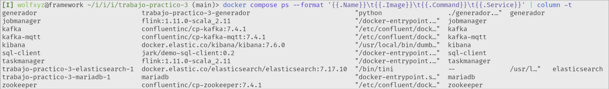
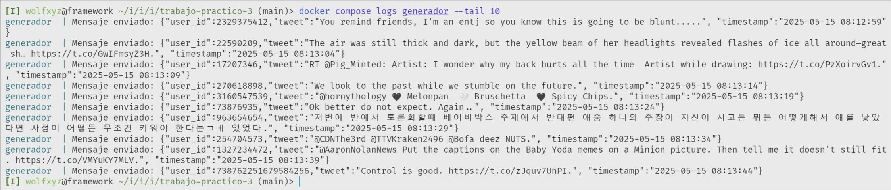
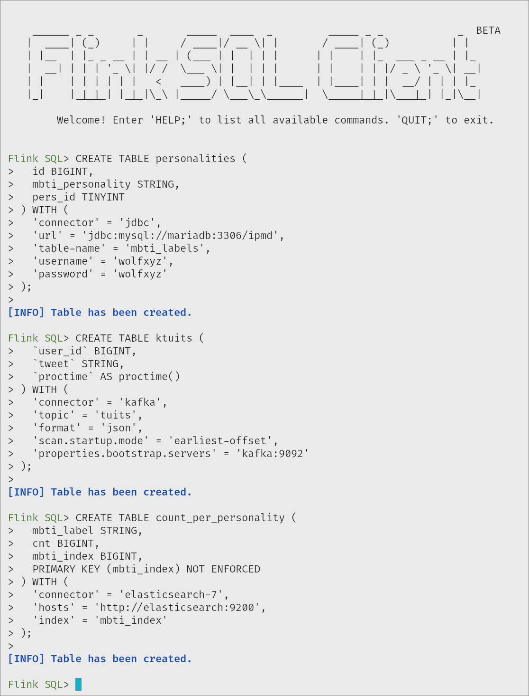
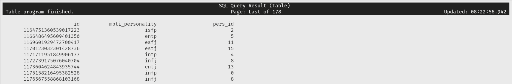
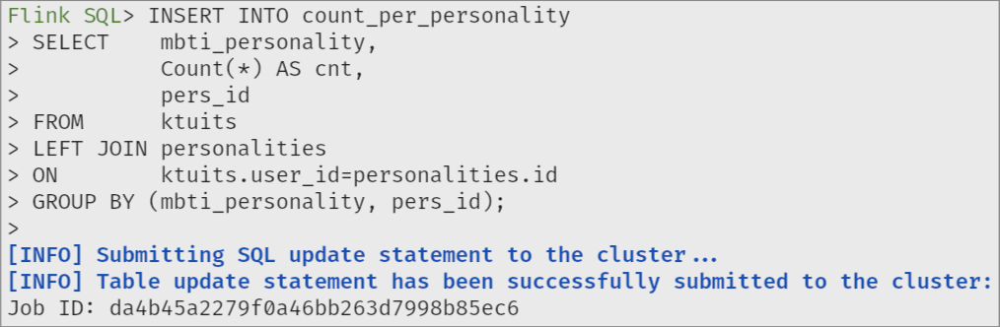
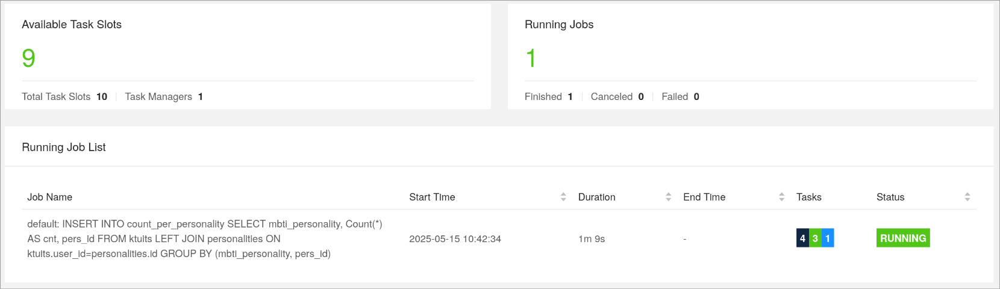
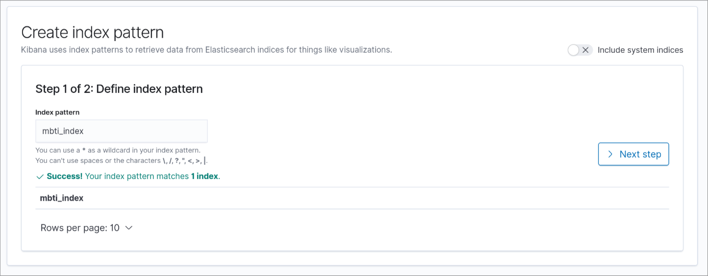
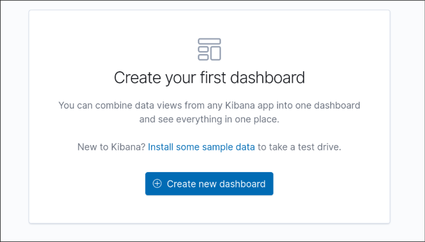
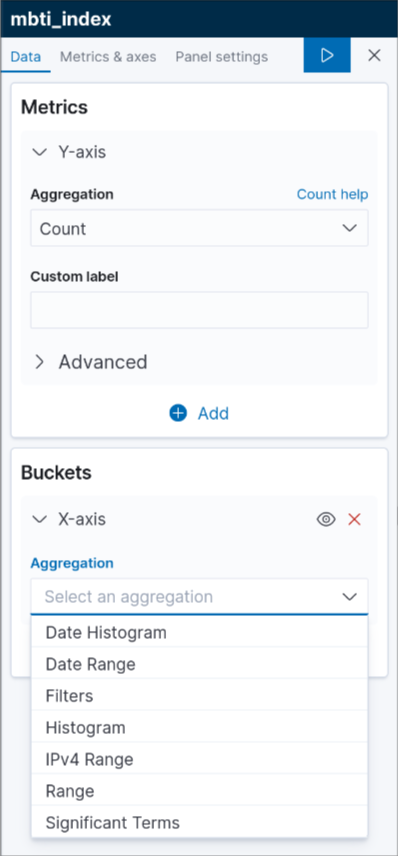
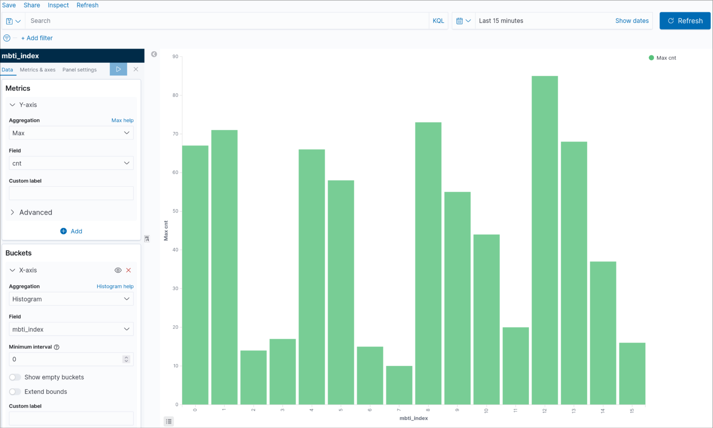

# Trabajo práctico 2. Yeray Carretero y Yeray Li.

## Estructura del proyecto

```bash
├── data
│   ├── edges1.json
│   ├── mbti_labels.csv
│   ├── tweets1.json
│   └── users1.json
├── db
│   └── init.sql
├── docker-compose.yaml
├── download-data.sh
├── generador
│   ├── Dockerfile
│   ├── generador.py
│   └── requeriments.txt
├── memoria.md
├── README.md
└── sql-client
    ├── Dockerfile
    ├── proccesData.java
    └── procress-data.sql
```

* `docker-compose.yaml`: Orquesta todos los servicios (BD, Flink, Generador, Elasticsearch, etc.) en contenedores.
* `db/init.sql`: Script SQL que inicializa la base de datos y crea las tablas necesarias. En este trabajo, las tablas creadas son para asegurar la implementación tanto de grafana como de superset
* `generador.py`: Script para la ejecución del contenedor que va a generar los tweets y publicarlos en el topic ktuits.
* `download-data.sh`: Script que nos permite descargar los datos con los que vamos a trabajar en un solo paso.

Ahora vamos a explicar que hace cada servicio que se detallada en el archivo `docker-compose.yaml` y los archivos que lo componen.

## Servicio generador

El contenedor ejecutara un archivo Python que sera el encargado de generar eventos – cada tuit es un evento – estos serán enviados a un tema MQTT. Los mensajes enviados a ese tema serán automáticamente reenviados a un clúster Kafka. 

### [`generador/Dockerfile`](https://github.com/Wolfxyz16/ipmd-yeray2/blob/main/trabajo-practico-3/generador/Dockerfile) 

Imagen del contendor.

```Dockerfile
FROM python:3

WORKDIR /trabajo-practico-3

COPY generador/requeriments.txt .
RUN pip install --no-cache-dir -r requeriments.txt

COPY ./generador/generador.py .
RUN chmod +x ./generador.py


CMD [ "sh", "-c", "sleep 10 && python generador.py" ]
```

### [`generador/generador.py`](https://github.com/Wolfxyz16/ipmd-yeray2/blob/main/trabajo-practico-3/generador/generador.py)

Script que generara los eventos.

```py
import json
import numpy as np
from datetime import datetime
import time
import paho.mqtt.client as mqtt

print("Starting generador.py")

json_file = 'data/tweets1.json'
gap = 5

# Definir los parámetros del broker MQTT
topic = "ktuits"
client_id = "generador"  # Un ID único para tu cliente MQTT

# Crear un cliente MQTT
client = mqtt.Client(client_id=client_id, callback_api_version=mqtt.CallbackAPIVersion.VERSION2)

# Callback para cuando el cliente se conecta
def on_connect(client, userdata, flags, rc, properties):
    print(f"Conectado con código {rc}")
    # Suscribirse al tema después de conectarse
    client.subscribe(topic,0)

# Asignar los callbacks
client.on_connect = on_connect

# Conectar al broker MQTT
while True:
    try:
        client.connect("kafka-mqtt", 1883, 60)
        print("Conectado al broker MQTT")
        break  # Si la conexión es exitosa, salir del bucle
    except Exception as e:
        print(f"Conexión fallida: {e}. Reintentando en 5 segundos...")
        time.sleep(5)  # Espera 5 segundos antes de reintentar

client.loop_start()

# Abrir el archivo de tweets y publicarlos
with open(json_file, 'r') as file:
    tweets = json.load(file)
    while True:
        try:
            user = np.random.randint(len(tweets))
            tweet = np.random.randint(len(tweets[user]["tweets"]))
            now = datetime.now()
            formatted = now.strftime("%Y-%m-%d %H:%M:%S")
            text = tweets[user]["tweets"][tweet].encode('utf-8','ignore').decode("utf-8").replace('\n', ' ')
            text += "."
            text = text.replace('"', "")
            text = text.replace('\\', "")
            message = '{"user_id":' + str(tweets[user]["id"]) + ',"tweet":"' + text + '", "timestamp":"' + formatted + '"}'
            
            # Publicar el mensaje
            client.publish(topic, message)
            print(f"Mensaje enviado: {message}")
            
        except json.JSONDecodeError as e:
            print(f"Error decoding JSON: {e}")
        
        # Introducir un retraso entre las publicaciones
        time.sleep(gap)

# Detener el cliente MQTT (en caso de que se necesite finalizar el proceso)
client.loop_stop()  # Detener el loop de MQTT
client.disconnect()  # Desconectar del broker
```

## Servicios Zookeper, Flink, Kafka, etc.

### Zookeper

El servicio zookeeper actúa como coordinador central en sistemas distribuidos. Proporciona un servicio de nombres, sincronización y gestión de configuración para aplicaciones distribuidas como Kafka o HDFS. Su función principal es garantizar la coherencia y disponibilidad de la información compartida entre nodos.

```yaml
  zookeeper:
    image: confluentinc/cp-zookeeper:7.4.1
    container_name: zookeeper
    ports:
      - "2181:2181"
    environment:
      ZOOKEEPER_CLIENT_PORT: 2181
```

### Kafka

El servicio kafka es una plataforma de mensajería distribuida utilizada para construir pipelines de datos y sistemas de transmisión en tiempo real. Funciona como intermediario entre productores y consumidores de mensajes, garantizando durabilidad y tolerancia a fallos. Este contenedor se conecta a Zookeeper para coordinarse y escucha conexiones en el puerto 9092, usado por productores y consumidores Kafka.

```yaml
  kafka:
    image: confluentinc/cp-kafka:7.4.1
    container_name: kafka
    ports:
      - "9092:9092"
    depends_on:
      - zookeeper
    environment:
      KAFKA_BROKER_ID: 1
      KAFKA_ZOOKEEPER_CONNECT: zookeeper:2181
      KAFKA_ADVERTISED_LISTENERS: PLAINTEXT://kafka:9092
      KAFKA_LISTENER_SECURITY_PROTOCOL_MAP: PLAINTEXT:PLAINTEXT

```

### Kafka-MQTT

El servicio kafka-mqtt actúa como un puente entre el protocolo MQTT y Apache Kafka. Permite recibir datos publicados por dispositivos o clientes MQTT y redirigirlos automáticamente a un tema Kafka. Este contenedor es clave para integrar flujos de datos de sensores u otros sistemas embebidos con plataformas de análisis como Flink o Elasticsearch.

```yaml
  kafka-mqtt:
    image: confluentinc/cp-kafka-mqtt:7.4.1
    container_name: kafka-mqtt
    environment:
      KAFKA_MQTT_BOOTSTRAP_SERVERS: kafka:9092
      KAFKA_MQTT_TOPIC_REGEX_LIST: tuits:ktuits
      KAFKA_MQTT_LICENSE_TOPIC_REPLICATION_FACTOR: 1
      KAFKA_MQTT_CONFLUENT_TOPIC_REPLICATION_FACTOR: 1 
    ports:
      - "1883:1883"
    depends_on:
      - kafka
    networks:
      - ipmd-net
```

### Elasticsearch

El servicio elasticsearch es un motor de búsqueda y análisis distribuido. Indexa y almacena datos estructurados en documentos JSON, permitiendo búsquedas rápidas y complejas en grandes volúmenes de información. Este contenedor escucha por defecto en el puerto 9200, y forma la base del stack ELK (Elasticsearch, Logstash, Kibana) para análisis de logs y datos en tiempo real.

```yaml
  elasticsearch:
    image: docker.elastic.co/elasticsearch/elasticsearch:7.17.10
    environment:
      - ES_JAVA_OPTS=-Dlog4j2.disable.jmx=true
      - cluster.name=docker-cluster
      - bootstrap.memory_lock=true
      - "ES_JAVA_OPTS=-Xms512m -Xmx512m"
      - discovery.type=single-node
    ports:
      - "9200:9200"
      - "9300:9300"
    ulimits:
      memlock:
        soft: -1
        hard: -1
      nofile:
        soft: 65536
        hard: 65536
    networks:
        - ipmd-net
```

### Mariadb

En el servicio de Mariadb hay alojada un servidor mariadb que se encarga de almacenar toda la información. Cuando una instancia web recibe una petición REST, esta se comunica con el servidor para llevar a cabo la tarea. A la hora de crear el contenedor, le pasamos los datos `mbti_labels.csv` montamos un volumen en el directorio `/docker-entrypoint-initdb.d/`. Dentro del volumen le pasamos un pequeño script sql para que el servidor ejecutará al iniciarse. Dentro del script creamos la base de datos, definimos las tablas, creamos los usuarios y definimos los permisos para que solo puedan acceder a la base de datos de la aplicación.

```yaml
  mariadb:
    image: mariadb
    restart: always
    ports:
      - "3306:3306"
    volumes:
      - ./db:/docker-entrypoint-initdb.d/:ro
      - ./data/mbti_labels.csv:/tmp/data/mbti_labels.csv
    environment:
      MYSQL_ROOT_PASSWORD: root
      MYSQL_USER: wolfxyz
      MYSQL_PASSWORD: wolfxyz
      MYSQL_DATABASE: ipmd
    networks:
        - ipmd-net
```

El servicio mariadb contiene el servidor donde se ejecuta el SGBD mariadb. Indicamos la imagen de mariadb, definimos el nombre y que cuando el servicio se caiga o docker se detenga (`restart: always`). En la línea de puerto mapeamos el puerto 3306 con el puerto 3306 de nuestro ordenador. En volumenes le indicamos el directorio  `./db` de nuestro repositorio, en el encontramos un script que el servidor ejecutará cada vez que se inicie.

En la línea de `environment` le indicamos al contenedor las variables de entorno que tiene que tener sus sistema operativo. En nuestro caso nos ayudan a pre-configurar el servidor mariadb.

### Kibana

El servicio kibana proporciona una interfaz web para visualizar y explorar los datos almacenados en Elasticsearch. Permite construir dashboards, realizar búsquedas, aplicar filtros y explorar temporalmente los datos. Este contenedor se conecta a Elasticsearch y expone la interfaz gráfica en el puerto 5601.

```yaml
  kibana:
    image: docker.elastic.co/kibana/kibana:7.6.0
    container_name: kibana
    environment:
      - ELASTICSEARCH_HOSTS=http://elasticsearch:9200
    ports:
      - "5601:5601"
    depends_on:
      - elasticsearch
    networks:
        - ipmd-net
```

### Jobmanager

El servicio jobmanager es el nodo maestro del sistema Apache Flink, responsable de coordinar la ejecución de trabajos de procesamiento de datos en tiempo real o por lotes. Asigna tareas a los TaskManagers, gestiona puntos de control y reinicios, y expone su interfaz de control en el puerto 8081.

```yaml
  jobmanager:
    image: flink:1.11.0-scala_2.11
    container_name: jobmanager
    ports:
      - "8081:8081"
    command: jobmanager
    environment:
      - |
        FLINK_PROPERTIES=
        jobmanager.rpc.address: jobmanager
    networks:
        - ipmd-net
```

### Taskmanager

El servicio taskmanager ejecuta las tareas asignadas por el JobManager en Flink. Es responsable de realizar el procesamiento distribuido de los datos, gestionar la memoria y las redes locales, y comunicar resultados intermedios. En un clúster, se pueden escalar varios TaskManagers para distribuir la carga de trabajo.

```yaml
  taskmanager:
    image: flink:1.11.0-scala_2.11
    container_name: taskmanager
    depends_on:
      - jobmanager
    command: taskmanager
    environment:
      - |
        FLINK_PROPERTIES=
        jobmanager.rpc.address: jobmanager
        taskmanager.numberOfTaskSlots: 10
    networks:
        - ipmd-net
```

### SQL-client

El servicio sql-client permite ejecutar sentencias SQL sobre streams y tablas definidas en Flink. Es una herramienta interactiva que facilita el desarrollo, prueba y ejecución de consultas sin necesidad de escribir código Java o Scala. Se conecta al entorno de Flink y permite explorar en tiempo real los resultados de consultas sobre fuentes como Kafka, Elasticsearch o archivos.

```yaml
  sql-client:
    image: jark/demo-sql-client:0.2
    container_name: sql-client
    depends_on:
      - kafka
      - jobmanager
      - elasticsearch
    environment:
      FLINK_JOBMANAGER_HOST: jobmanager
      ZOOKEEPER_CONNECT: zookeeper
      KAFKA_BOOTSTRAP: kafka
      MYSQL_HOST: mariadb
      ES_HOST: elasticsearch
    networks:
      - ipmd-net
```

---

## Modo de uso

Vamos a explicar paso a paso como replicar este proyecto.

### 1. Clona el repositorio y accede al directorio del tercer proyecto:

```bash
git clone https://github.com/Wolfxyz16/ipmd-yeray2.git
cd ipmd-yeray2/trabajo-practico-3
```

### 2. Descarga de datos

En caso de no tener los datos con los que vamos a trabajar descargados. Podría ser que tengas que dar permiso al ejecutable.

```bash
chmod +x download-data && sh download-data.sh
```

### 2. Construir y arrancar el `docker-compose`

```bash
docker compose compose build
```

Lo arrancamos y lo ponemos en segundo plano.

```bash
docker compose compose up --detach
```

Ahora podemos comprobar que los contendores están levantados con el siguiente comando

```bash
docker compose ps
```

Deberiamos ver los siguientes contenedores



Debemos esperar unos segundos antes de continuar con la guia con el fin de que todos los contenedores arranquen correctamente, sobre todo la base de datos mariadb.

### 3. Crompobar que el contenedor generador esta generando los tweets

Una vez arrancados todos los contenedores debemos esperar para estar seguros de que el generador esta creando los datos 

```bash
docker logs --follow generador
```

Sabremos que el script generador.py a iniciado correctamente cuando veamos los datos generados por terminal



### 4. Creamos las tablas 

Una vez tenemos el generador funcionando correctamente crearemos las tablas mediante el script `sql-client.sh`. Lo ejecutaremos de la siguiente manera. Cómo vamos a insertar las tablas manualmente tendremos que hacerlo de forma interactiva:

```bash
docker compose exec -it sql-client ./sql-client.sh
```

Ahora que hemos accedido a flink debemos crear las siguientes tablas:

```sql
CREATE TABLE ktuits (
  `user_id` BIGINT,
  `tweet` STRING,
  `proctime` AS proctime()
) WITH (
  'connector' = 'kafka',
  'topic' = 'tuits',
  'format' = 'json',
  'scan.startup.mode' = 'earliest-offset',
  'properties.bootstrap.servers' = 'kafka:9092'
);
```

```sql
CREATE TABLE personalities (
  id BIGINT,
  mbti_personality STRING,
  pers_id TINYINT
) WITH (
  'connector' = 'jdbc',
  'url' = 'jdbc:mysql://mariadb:3306/ipmd',
  'table-name' = 'mbti_labels',
  'username' = 'wolfxyz',
  'password' = 'wolfxyz'
);
```

```sql
CREATE TABLE count_per_personality (
  mbti_label STRING,
  cnt BIGINT,
  mbti_index BIGINT,
  PRIMARY KEY (mbti_index) NOT ENFORCED
) WITH (
  'connector' = 'elasticsearch-7',
  'hosts' = 'http://elasticsearch:9200',
  'index' = 'mbti_index'
);
```

Si hemos realizado las acciones correctamente deberiamos recibir un mensaje diciendo que las tablas se han creado correctamente:



Es más, si hacemos un `select` de la tabla `ktuits` o `personalities` deberiamos ver algo parecido a esto:

```sql
SELECT * FROM personalities;
```



### 5. Crear un job y enlazarlo con elasticsearch

El siguiente paso es el más importante. Vamos a insertar datos en la tabla `count_per_personality` con un comando `INSERT` en el que haremos un `JOIN` de las otras dos tablas. Esta operación lanzará un *job* que podremos ver activo en el *dashboard* de flink.

```sql
INSERT INTO count_per_personality
SELECT    mbti_personality,
          Count(*) AS cnt,
          pers_id
FROM      ktuits
LEFT JOIN personalities
ON        ktuits.user_id=personalities.id
GROUP BY (mbti_personality, pers_id);
```

 

Dentro del dashboard de Flink observamos que el *job* se ha lanzado y se está ejecutando correctamente:

 

### 6. Kibana

Para la creación de graficas en Kibana debemos acceder a su interfaz web desde un navegador. Así que vamos a ir a la dirección:

#### [http://localhost:5601](http://localhost:5601)

Dentro de Kibana accedemos a la *Visualize*. Nos pedirán que crear un *index pattern* que vamos a asociar con el *mbti_index*.

 

*Next step* > *Create index pattern*. 

Ahora podremos crear el gráfico de los datos. Vamos a acceder a la parte que indica *dashboard* y seleccionamos *Create a new dashboard*:

 

Vamos a crear un gráfico de barras verticales para poder ver el recuento de personalidades a medida que el generador va publicando los tweets.

Seleccionamos el índice que hemos creado anteriormente:

 

Ahora tendremos que configurar nuestro gráfico para verlo como nosotros queremos. Vamos a crear un nuevo *X-Axis* seleccionando la zona que dice *Buckets*. Cómo agregación vamos a elegir *histogram*.

 

Dentro del *Bucket*>*X-axis* vamos a seleccionar *mbti_index* como *field* y ponemos el intervalo mínimo a 0. Luego en la parte del *Y-axis* debemos poner *Max* como *Aggregation* y en *Field* debemos poner *cnt*. Una vez terminemos todo pulsamos sobre el boton de play y podremos ya contemplar el resultado final.

 


Podemos observar como los datos son en tiempo real si vamos refrescando pulsando en el botón azul que dice *Refresh*.
